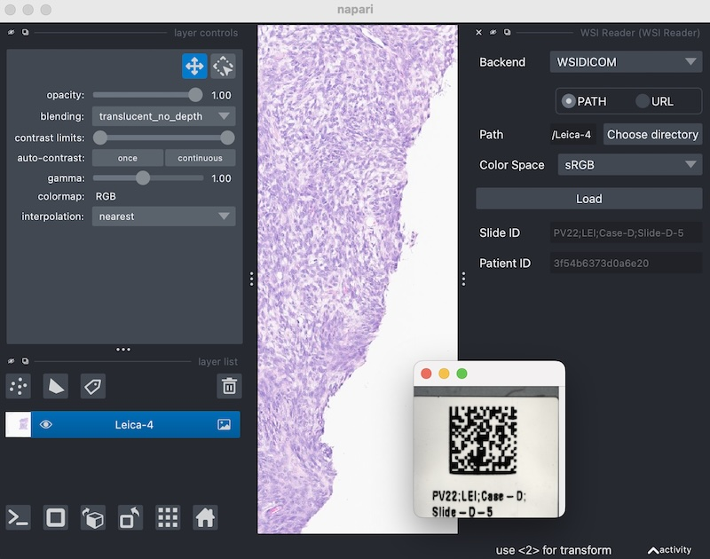

# napari-wsi

[](https://pypi.org/project/napari-wsi)
[](https://napari-hub.org/plugins/napari-wsi)
[](https://github.com/AstraZeneca/napari-wsi/actions)


A plugin to read whole-slide images within [napari].

---

## Installation via pip

You can install `napari-wsi` via [pip]:

```bash
pip install "napari-wsi[all]>=1.0"
```

This automatically installs all optional backends, as a shortcut for:

```bash
pip install "napari-wsi[openslide,rasterio,wsidicom]>=1.0"
```

In addition, to be able to read images using the `openslide` backend, it is
required to install the OpenSlide library itself, for example by installing the
[openslide-bin] python package (also via [pip]).

## Installation via conda

You can also install `napari-wsi` via [conda]:

```bash
conda install -c conda-forge "napari-wsi>=1.0"
```

This already installs all optional dependencies, including OpenSlide.

# Description

This [napari] plugin provides a widget for reading various whole-slide image
formats using a common [zarr] store inteface, based on the libraries
[openslide], [rasterio], and [wsidicom].

# Quickstart

After installation, open the `Plugins` menu in the viewer and select
`WSI Reader` to open the widget. Then select a `Backend` to use, select a `Path`
to open, and click `Load`.



If `sRGB` is selected in the `Color Space` menu and an ICC profile is attached
to the given image, a transformation to this color space will be applied when
the image data is read. Otherwise, the raw RGB image data will be displayed.

This plugin can also be used to open image files via drag and drop into the
viewer window. The file suffixes '.bif', '.ndpi', '.scn', '.svs' are registered
with the `openslide` backend, while the suffixes '.tif' and '.tiff' are
registered with the `rasterio` backend. These files can also be opened directly
from the command line or from a python script:

```bash
napari CMU-1.svs
```

```python
from napari import Viewer

viewer = Viewer()
viewer.open("CMU-1.svs", plugin="napari-wsi")
```

It is also possible to use the different backend classes directly, in which case
some more features are available, for example:

```python
from napari import Viewer
from napari_wsi.backends.openslide import OpenSlideStore

viewer = Viewer()

# Display the image in the sRGB color space and a physical coordinate system:
store = OpenSlideStore("CMU-1.svs", color_space="sRGB")
(layer,) = store.to_viewer(viewer, spatial_transform=True)
assert layer.metadata["color_space"] == "sRGB"

# Display a scale bar to indicate milli- or micrometers, depending on the zoom level:
viewer.scale_bar.visible = True
viewer.scale_bar.colored = True
```

```python
from napari import Viewer
from napari_wsi.backends.wsidicom import WSIDicomStore
from requests.auth import HTTPBasicAuth
from wsidicom import WsiDicomWebClient

viewer = Viewer()
client = WsiDicomWebClient.create_client("...", auth=HTTPBasicAuth("...", "..."))
store = WSIDicomStore(client=client, study_uid="...", series_uids="...")
store.to_viewer(viewer)
```

The sample images used above are part of the OpenSlide test data (see [Aperio]
and [DICOM]).

# Known Issues & Other Notes

- This plugin is prototype research software and there may be **breaking
  changes** with each release of the plugin, which is also the case for current
  releases of the [napari] viewer itself.
- The `wsidicom` backend supports loading annotations together with the image
  data. However, this may take several minutes, depending on the number and
  complexity of the annotations. When loading more than a few thousand polygon
  annotations, make sure that the experimental "[triangles] speedup" setting is
  enabled.

[Aperio]: https://openslide.cs.cmu.edu/download/openslide-testdata/Aperio/
[conda]: https://conda-forge.org/
[DICOM]: https://openslide.cs.cmu.edu/download/openslide-testdata/DICOM/
[napari]: https://github.com/napari/napari
[openslide]: https://github.com/openslide/openslide-python
[openslide-bin]: https://pypi.org/project/openslide-bin/
[pip]: https://github.com/pypa/pip
[rasterio]: https://github.com/rasterio/rasterio
[triangles]: https://napari.org/island-dispatch/blog/triangles_speedup_beta.html
[wsidicom]: https://github.com/imi-bigpicture/wsidicom
[zarr]: https://github.com/zarr-developers/zarr-python
